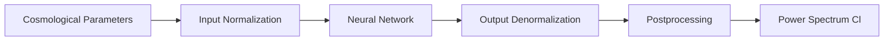

# User Guide Overview

This guide provides detailed information on using JaxCapse for CMB power spectrum emulation.

## What is JaxCapse?

JaxCapse is a JAX-based neural network emulator for computing CMB power spectra. It provides:

- **Speed**: ~1000x faster than Boltzmann solvers
- **Accuracy**: Sub-percent precision across parameter space
- **Differentiability**: Automatic gradients for parameter estimation
- **Efficiency**: Batch processing and GPU acceleration

## Architecture

JaxCapse consists of:

1. **Neural Network Core**: Multi-layer perceptron trained on Boltzmann solver outputs
2. **JAX Integration**: Full compatibility with JAX transformations
3. **Normalization Layer**: Input/output scaling for numerical stability
4. **Postprocessing**: Spectrum-specific transformations

## Workflow



## Supported Parameters

JaxCapse emulators take 6 cosmological parameters:

| Parameter | Symbol | Description | Typical Range |
|-----------|--------|-------------|---------------|
| ln10As | ln(10¹⁰As) | Log amplitude of primordial fluctuations | [2.5, 3.5] |
| ns | ns | Scalar spectral index | [0.88, 1.05] |
| H0 | H₀ | Hubble constant [km/s/Mpc] | [40, 100] |
| ωb | Ωbh² | Physical baryon density | [0.019, 0.025] |
| ωc | Ωch² | Physical CDM density | [0.08, 0.20] |
| τ | τ | Optical depth to reionization | [0.02, 0.12] |

## Available Spectra

JaxCapse provides emulators for:

- **TT**: Temperature auto-correlation
- **EE**: E-mode polarization auto-correlation
- **TE**: Temperature-E-mode cross-correlation
- **PP**: Lensing potential auto-correlation

## Performance Characteristics

### Speed Benchmarks

| Operation | Time | Notes |
|-----------|------|-------|
| Single evaluation | ~50 μs | After JIT compilation |
| First evaluation | ~1 ms | Includes JIT compilation |
| Gradient (6 params) | ~400 μs | Using automatic differentiation |
| Batch (1000 samples) | ~10 ms | Vectorized computation |

### Memory Usage

- Single emulator: ~10 MB
- All four emulators: ~40 MB
- Batch processing scales linearly with batch size

## Key Features

### 1. JIT Compilation
Functions are compiled on first use for optimal performance:
```python
@jax.jit
def fast_computation(params):
    return emulator.get_Cl(params)
```

### 2. Automatic Differentiation
Compute gradients without finite differences:
```python
grad_fn = jax.grad(lambda p: jnp.sum(emulator.get_Cl(p)))
```

### 3. Vectorization
Process multiple parameter sets efficiently:
```python
vmap_fn = jax.vmap(emulator.get_Cl)
```

### 4. GPU Acceleration
Automatically uses GPU if available:
```python
print(jax.devices())  # Check available devices
```

## Best Practices

1. **Stay Within Bounds**: Keep parameters within training ranges
2. **Use JAX Arrays**: Always pass JAX arrays, not Python lists
3. **Batch When Possible**: Process multiple cosmologies together
4. **Reuse Compiled Functions**: JIT compilation happens once per shape

## Common Use Cases

- **Parameter Estimation**: MCMC sampling with fast likelihood evaluation
- **Fisher Forecasting**: Compute derivatives for Fisher matrix analysis
- **Sensitivity Analysis**: Explore parameter dependencies
- **Optimization**: Find best-fit cosmological parameters

## Limitations

- Fixed cosmological model (ΛCDM with massless neutrinos)
- Limited parameter ranges (training bounds)
- Fixed ℓ range (typically ℓ = 2 to 5000)
- No non-linear corrections at very small scales

## Next Steps

- [Loading Emulators](loading.md): How to load and configure emulators
- [Computing Spectra](computing.md): Detailed computation guide
- [Batch Processing](batch.md): Efficient multi-cosmology processing
- [JAX Features](jax_features.md): Advanced JAX functionality